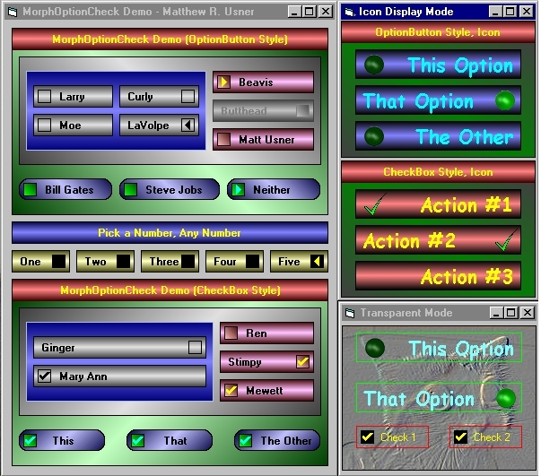

## MorphOptionCheck 2\.22 \- Combo OptionButton/CheckBox UserControl

### Description

MorphOptionCheck is a subclassed, ownerdrawn usercontrol that combines the functionality of VB's OptionButton and CheckBox controls. Uses version 2.1 of Paul Caton's self-sub usercontrol code. Unicode supported. Background and border of control may be rendered transparent. A much-improved version of a control I had posted on PSC for a short time about a year ago. As always, constructive comments welcome, votes appreciated.

----

11 April 2006 - Added icon display capability, you can now use icons in place of standard checkboxes. Rearranged and tightened up code, added property to allow you to not display focus rectangle, and added code to allow you to see changes as you are making them in design mode. Added property descriptions in IDE property window.
 
### More Info
 
You may go blind from the overly colorful demo project :D

             |
---                |---
**Submitted On**   |2006-04-27 17:53:12
**By**             |[Option Explicit](https://github.com/Planet-Source-Code/PSCIndex/blob/master/ByAuthor/option-explicit.md)
**Level**          |Intermediate
**User Rating**    |5.0 (135 globes from 27 users)
**Compatibility**  |VB 6\.0
**Category**       |[Custom Controls/ Forms/  Menus](https://github.com/Planet-Source-Code/PSCIndex/blob/master/ByCategory/custom-controls-forms-menus__1-4.md)
**World**          |[Visual Basic](https://github.com/Planet-Source-Code/PSCIndex/blob/master/ByWorld/visual-basic.md)
**Archive File**   |[MorphOptio1990204272006\.zip](https://github.com/Planet-Source-Code/option-explicit-morphoptioncheck-2-22-combo-optionbutton-checkbox-usercontrol__1-64948/archive/master.zip)

